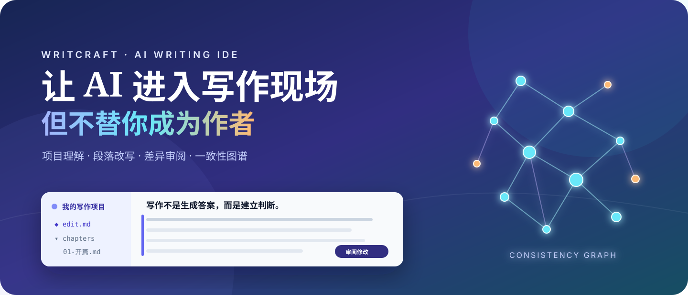
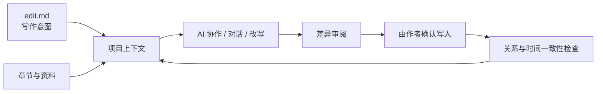

<div align="center">
  

  # 笔触 · WritCraft

  **为专业长文作者打造的 Cursor 式 AI 写作 IDE**

  让 AI 读懂整个项目、协助每一个段落，同时把每一次修改的决定权留给你。

  [快速开始](#三分钟开始写作) · [完整指南](docs/GETTING-STARTED.md) · [产品路线图](docs/ROADMAP.md) · [报告问题](https://github.com/MaxHou-infinity/WritCraft/issues)
</div>

> [!IMPORTANT]
> 当前为 **macOS Developer Preview**，采用专有评估许可证。它适合体验和反馈，尚不是面向生产环境的正式版本。请先备份重要文稿。

## 写长文，不该在五个工具之间来回奔波

写一本书、一份研究报告或一篇方法论长文，需要同时管理结构、上下文、事实、人物关系和大量修订。普通 AI 对话很快忘记前文，传统编辑器又不理解你的写作意图。

笔触把 Cursor 的项目式 AI 协作带进写作现场：

- **项目级**：用 `edit.md` 固化主旨、读者、边界与大纲，让 AI 始终理解整部作品。
- **文件级**：在章节之间切换、检索和跨文件修订，不再反复复制上下文。
- **段落级**：选中原文，按 `⌘K` 写下本次改写要求，再逐项审阅差异；接受、拒绝或重载都清清楚楚。`⌘L` 则专注项目、文件与选区对话。
- **一致性图谱**：追踪人物、概念、变量、关系与时间，提前发现冲突、遗漏和漂移。
- **研究与溯源**：把来源、主张和适用边界留在写作流程里，而不是散落在浏览器标签页中。
- **本地 Markdown**：作品仍是你熟悉的文件，方便备份、迁移和版本管理。



在笔触里，“接受建议”只是完成审阅选择；只有点击底部确认按钮，修改才会安全写入项目。已决定的 Diff 会收起成摘要，随时可以在写入前改主意。

## 三分钟开始写作

### 1. 准备运行环境

- macOS 12 或更高版本
- Node.js 22.12 或更高版本
- npm 10 或 npm 11

### 2. 启动笔触

```bash
npx writ-craft@preview
```

想先确认环境而不启动应用：

```bash
npx writ-craft@preview --check
```

### 3. 打开或创建写作项目

推荐从这个简单结构开始：

```text
我的写作项目/
├── edit.md             # 主旨、目标读者、写作边界与结构
├── chapters/
│   ├── 01-开篇.md
│   └── 02-核心观点.md
└── references/         # 资料与引用
```

第一次使用时，先打开 `edit.md`，把“为什么写、写给谁、要讲清什么”告诉笔触。你可以直接进入章节，通过项目对话、段落改写和一致性图谱推进作品。当前公开的 `0.1.2` Preview 已包含“处理建议 → 正文内 Diff → 接受或撤销”的统一任务流；项目首页、当前文稿大纲、`⌘P` 快速打开和可恢复导航属于正在收口的 `0.2.0` 候选能力。

左侧书脊式活动栏在项目文件、搜索、来源与图谱之间保持唯一清晰的工作区状态；新建或打开其他项目时，从项目标题右侧的 `•••` 菜单进入。

更完整的首次启动、MiniMax 配置、推荐工作流和排错方法，请阅读 [《从安装到第一篇作品》](docs/GETTING-STARTED.md)。

## AI 帮你保持清醒，而不是替你下笔

笔触坚持三个原则：

1. **先理解意图，再改正文**：项目对话解释上下文，正文只通过可审阅 Diff 修改。
2. **修改必须可见**：AI 变更通过差异界面呈现，不静默覆盖作品。
3. **作者拥有最终决定权**：关键写入、来源判断和一致性结论都由作者确认。

MiniMax API Key 只应在应用设置中配置。不要把 Key 写进项目文件、终端命令、GitHub Issue 或诊断截图。AI 请求会产生第三方服务费用，具体能力与额度以服务商账号为准。

## 现在能做什么

| 写作环节 | 当前能力 |
| --- | --- |
| 项目启动 | `edit.md` 引导、项目卡、章节批量创建 |
| 日常写作 | 项目/文件/选区对话、段落改写、Chapter，以及候选版建议→正文内 Diff 统一任务 |
| 修订控制 | 差异审阅、历史记录、安全撤销、冲突恢复 |
| 长文理解 | 跨文件上下文、章节检索、来源与脚注 |
| 一致性 | 人物/概念/变量/时间关系图谱与问题回到正文 |
| 多模态 | MiniMax 图片生成、评分、插入与可恢复回收 |
| 隐私诊断 | 先预览、再导出的脱敏诊断信息 |

`0.2.0` 在 `0.1.2` 的基础上加入“项目状态 → 定位工作 → 编辑或审阅 → 返回项目状态”的日常写作工作区，并完成候选验收。GitHub/App 候选状态已记录；npm registry 的 `0.2.0` 公开状态尚未重新核实，因此不把它写成当前公开安装版本。

当前正在收口的 `0.3.0` 透明 AI 协作，已验证统一任务进度、受限 `@` 引用、Context Catalog 过期保护、正文内 Diff、Safe Undo、同 profile Key 重启恢复，以及真实作者源稿派生副本的 Chat → Navigation → Diff → 冲突阻止 → 接受 → Safe Undo；Chapter、Research、Graph、图片和独立复审尚未完成，不能视为已发布版本。

## Preview 边界

- 目前仅支持 macOS arm64 / x64，通过终端启动。
- 尚未提供 Apple Developer ID 签名与公证的 `.app` 安装包。
- 当前公开 Preview 为 `writ-craft@0.1.2`；安装时请始终显式使用 `@preview`。`0.2.0` 仍是候选/开发状态，`latest` 保留为上一稳定指针 `0.1.0`，不代表本次 prerelease。
- 重要文稿请保留独立备份；正式生产使用尚未开放。
- 源码公开可见，**不等于开源授权**。评估、复制和使用边界以 [专有评估许可证](LICENSE) 为准。

## 从 Preview 到可持续产品

笔触将沿着“真实作者可用 → 更稳定的个人创作工具 → 可持续的专业服务”推进。未来计划提供付费的 Pro 能力，例如更强的长文上下文、专业研究工作流、模型与费用管理，以及面向团队的协作与治理功能。

我们不会用付费功能削弱一个基本承诺：**你的作品归你，AI 的修改必须可见，作者始终拥有最后决定权。**

查看 [公开路线图](docs/ROADMAP.md)，了解当前阶段、未来付费方向和不会越过的产品边界。

## 参与笔触

- 遇到问题：提交 [Bug Report](https://github.com/MaxHou-infinity/WritCraft/issues/new)
- 有产品建议：发起 [Feature Request](https://github.com/MaxHou-infinity/WritCraft/issues/new)
- 涉及安全或隐私：请先阅读 [安全报告说明](SECURITY.md)，不要公开披露凭证或文稿
- 希望贡献：请阅读 [参与指南](CONTRIBUTING.md)

开发进度、验证证据和下一门禁记录在 [`v0/DEVELOPMENT-STATUS.md`](v0/DEVELOPMENT-STATUS.md)。内部工程材料不代表稳定版承诺。

## License

Copyright © 2026 Max Hou. All rights reserved.

WritCraft 当前依据 [WritCraft Proprietary Evaluation License 1.0](LICENSE) 提供。允许个人或组织内部评估；生产、商业交付、托管、转售、再分发和未经授权的衍生开发均受限制。第三方组件保留各自许可证。

---

<div align="center">
  <strong>好作品不是一次生成出来的。它来自清晰的意图、持续的修订，以及作者不肯让渡的判断。</strong>
  <br><br>
  如果你也相信 AI 应该放大作者，而不是取代作者，欢迎关注笔触的下一次进化。
</div>
